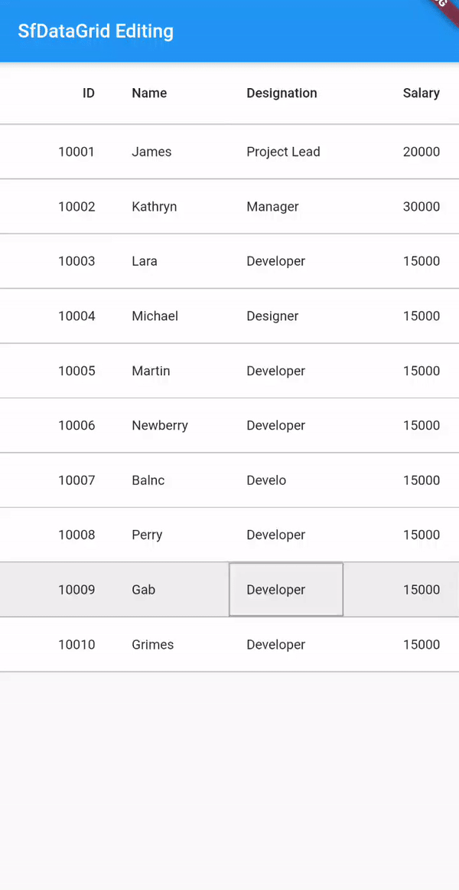

# How to perform editing in Flutter Datatable(SfDataGrid)

In this example, you will learn how to enable the editing in SfDataGrid and perform committing the edited cell value in collection

```xml
@override
Widget build(BuildContext context) {
  return Scaffold(
    body: SfDataGrid(
      source: _employeeDataSource,
      allowEditing: true,
      selectionMode: SelectionMode.single,
      navigationMode: GridNavigationMode.cell,
      columns: [
        GridColumn(
          columnName: 'id',
          label: Container(
            padding: EdgeInsets.symmetric(horizontal: 16.0),
            alignment: Alignment.centerRight,
            child: Text(
              'ID',
              overflow: TextOverflow.ellipsis,
            ),
          ),
        ),
        GridColumn(
          columnName: 'name',
          label: Container(
            padding: EdgeInsets.symmetric(horizontal: 16.0),
            alignment: Alignment.centerLeft,
            child: Text(
              'Name',
              overflow: TextOverflow.ellipsis,
            ),
          ),
        ),
        GridColumn(
          columnName: 'designation',
          label: Container(
            padding: EdgeInsets.symmetric(horizontal: 16.0),
            alignment: Alignment.centerLeft,
            child: Text(
              'Designation',
              overflow: TextOverflow.ellipsis,
            ),
          ),
        ),
        GridColumn(
          columnName: 'salary',
          label: Container(
            padding: EdgeInsets.symmetric(horizontal: 16.0),
            alignment: Alignment.centerRight,
            child: Text(
              'Salary',
              overflow: TextOverflow.ellipsis,
            ),
          ),
        ),
      ],
    ),
  );
}

class EmployeeDataSource extends DataGridSource {
  /// Helps to hold the new value of all editable widget.
  /// Based on the new value we will commit the new value into the corresponding
  /// DataGridCell on onCellSubmit method.
  dynamic newCellValue;

  /// Help to control the editable text in [TextField] widget.
  TextEditingController editingController = TextEditingController();

  @override
  void onCellSubmit(DataGridRow dataGridRow, RowColumnIndex rowColumnIndex,
      GridColumn column) {
    final dynamic oldValue = dataGridRow
            .getCells()
            .firstWhereOrNull((DataGridCell dataGridCell) =>
                dataGridCell.columnName == column.columnName)
            ?.value ??
        '';

    final int dataRowIndex = dataGridRows.indexOf(dataGridRow);

    if (newCellValue == null || oldValue == newCellValue) {
      return;
    }

    if (column.columnName == 'id') {
      dataGridRows[dataRowIndex].getCells()[rowColumnIndex.columnIndex] =
          DataGridCell<int>(columnName: 'id', value: newCellValue);
      _employees[dataRowIndex].id = newCellValue as int;
    } else if (column.columnName == 'name') {
      dataGridRows[dataRowIndex].getCells()[rowColumnIndex.columnIndex] =
          DataGridCell<String>(columnName: 'name', value: newCellValue);
      _employees[dataRowIndex].name = newCellValue.toString();
    } else if (column.columnName == 'designation') {
      dataGridRows[dataRowIndex].getCells()[rowColumnIndex.columnIndex] =
          DataGridCell<String>(columnName: 'designation', value: newCellValue);
      _employees[dataRowIndex].designation = newCellValue.toString();
    } else {
      dataGridRows[dataRowIndex].getCells()[rowColumnIndex.columnIndex] =
          DataGridCell<int>(columnName: 'salary', value: newCellValue);
      _employees[dataRowIndex].salary = newCellValue as int;
    }
  }

  @override
  Widget? buildEditWidget(DataGridRow dataGridRow,
      RowColumnIndex rowColumnIndex, GridColumn column, CellSubmit submitCell) {
    // Text going to display on editable widget
    final String displayText = dataGridRow
            .getCells()
            .firstWhereOrNull((DataGridCell dataGridCell) =>
                dataGridCell.columnName == column.columnName)
            ?.value
            ?.toString() ??
        '';

    // The new cell value must be reset.
    // To avoid committing the [DataGridCell] value that was previously edited
    // into the current non-modified [DataGridCell].
    newCellValue = null;    

    final bool isTextAlignRight =
        column.columnName == 'id' || column.columnName == 'salary';

    final bool isNumericKeyBoardType =
        column.columnName == 'id' || column.columnName == 'salary';

    return Container(
      padding: const EdgeInsets.all(8.0),
      alignment:
          isTextAlignRight ? Alignment.centerRight : Alignment.centerLeft,
      child: TextField(
        autofocus: true,
        controller: editingController..text = displayText,
        textAlign: isTextAlignRight ? TextAlign.right : TextAlign.left,
        decoration: InputDecoration(
            contentPadding: const EdgeInsets.fromLTRB(0, 0, 0, 16.0),
            focusedBorder: UnderlineInputBorder(
                borderSide: BorderSide(color: Colors.black))),
        keyboardType:
            isNumericKeyBoardType ? TextInputType.number : TextInputType.text,
        onChanged: (String value) {
          if (value.isNotEmpty) {
            if (isNumericKeyBoardType) {
              newCellValue = int.parse(value);
            } else {
              newCellValue = value;
            }
          } else {
            newCellValue = null;
          }
        },
        onSubmitted: (String value) {
          // In Mobile Platform.
          // Call [CellSubmit] callback to fire the canSubmitCell and
          // onCellSubmit to commit the new value in single place.
          submitCell();
        },
      ),
    );
  }
}
```



## Other useful links

 Check out the following resource to learn more about the Syncfusion Flutter DataGrid:

* [Syncfusion Flutter DataGrid Editing UG page](https://help.syncfusion.com/flutter/datagrid/editing)
* [Syncfusion Flutter DataGrid product page](https://www.syncfusion.com/flutter-widgets/flutter-datagrid)
* [User guide documentation](https://help.syncfusion.com/flutter/datagrid/overview)
